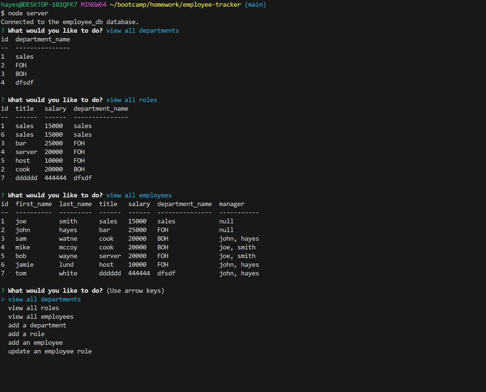

# employee-tracker

## Descripion

This project can be used by an employer to view departments, role, and employees. They can add more of them and update empolyees

## technologys

The project uses mySQL, Node, and JavaScript

## learned

I learned how to use access and change things in a mySQL db

## Task

GIVEN a command-line application that accepts user input
WHEN I start the application
THEN I am presented with the following options: view all departments, view all roles, view all employees, add a department, add a role, add an employee, and update an employee role
WHEN I choose to view all departments
THEN I am presented with a formatted table showing department names and department ids
WHEN I choose to view all roles
THEN I am presented with the job title, role id, the department that role belongs to, and the salary for that role
WHEN I choose to view all employees
THEN I am presented with a formatted table showing employee data, including employee ids, first names, last names, job titles, departments, salaries, and managers that the employees report to
WHEN I choose to add a department
THEN I am prompted to enter the name of the department and that department is added to the database
WHEN I choose to add a role
THEN I am prompted to enter the name, salary, and department for the role and that role is added to the database
WHEN I choose to add an employee
THEN I am prompted to enter the employee’s first name, last name, role, and manager, and that employee is added to the database
WHEN I choose to update an employee role
THEN I am prompted to select an employee to update and their new role and this information is updated in the database 

## Usage

If the user opens the terminal for the folder of the project and types “node server.js” the terminal will start going through a list of prompts. Select the options that fit your needs and follow additional prompts if needed.

## Repo
https://github.com/hayessea000/employee-tracker

## Video of use
https://drive.google.com/file/d/1iTZMJo9FY95B9aXHUZErqfVI6DEt721I/view
